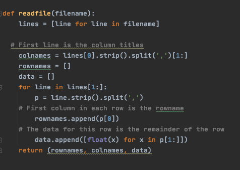
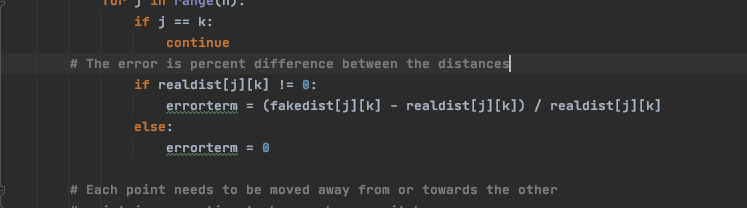
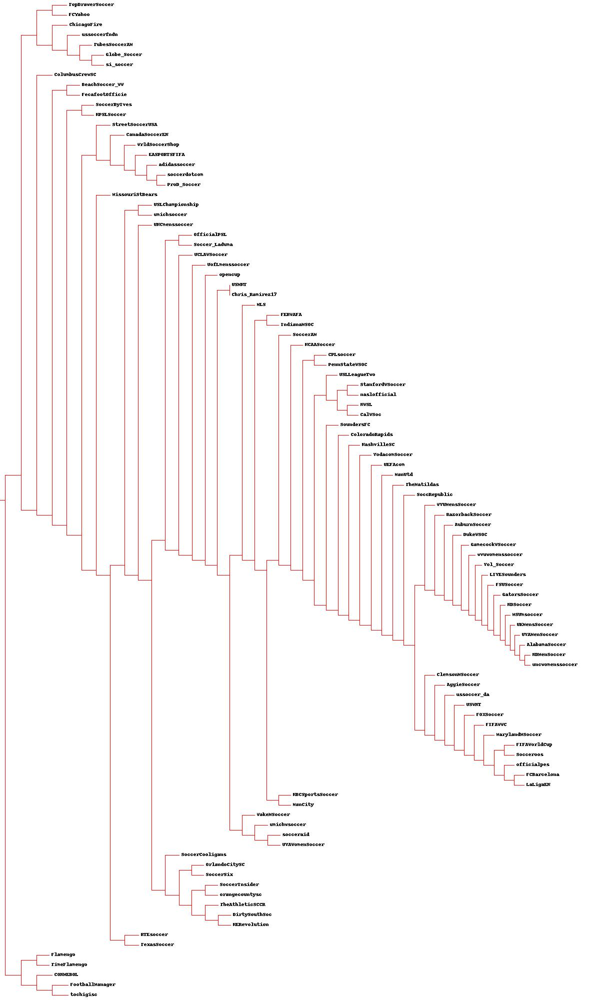
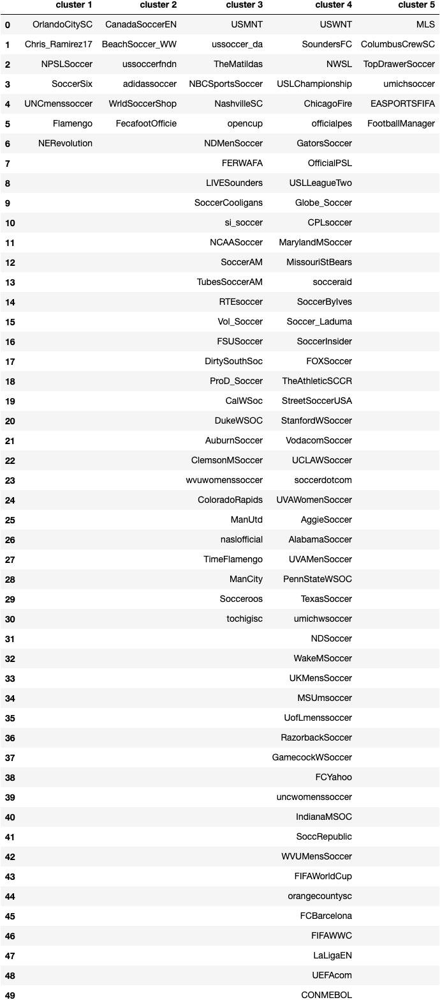
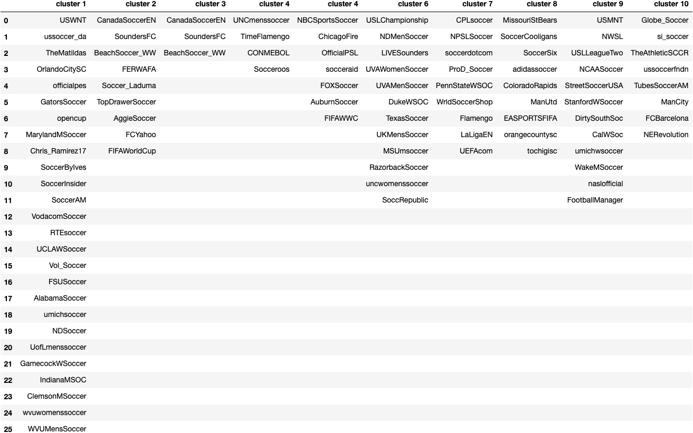
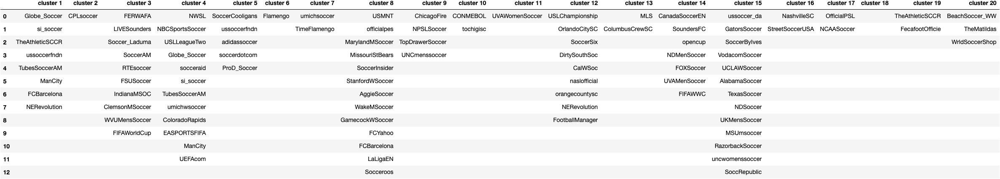
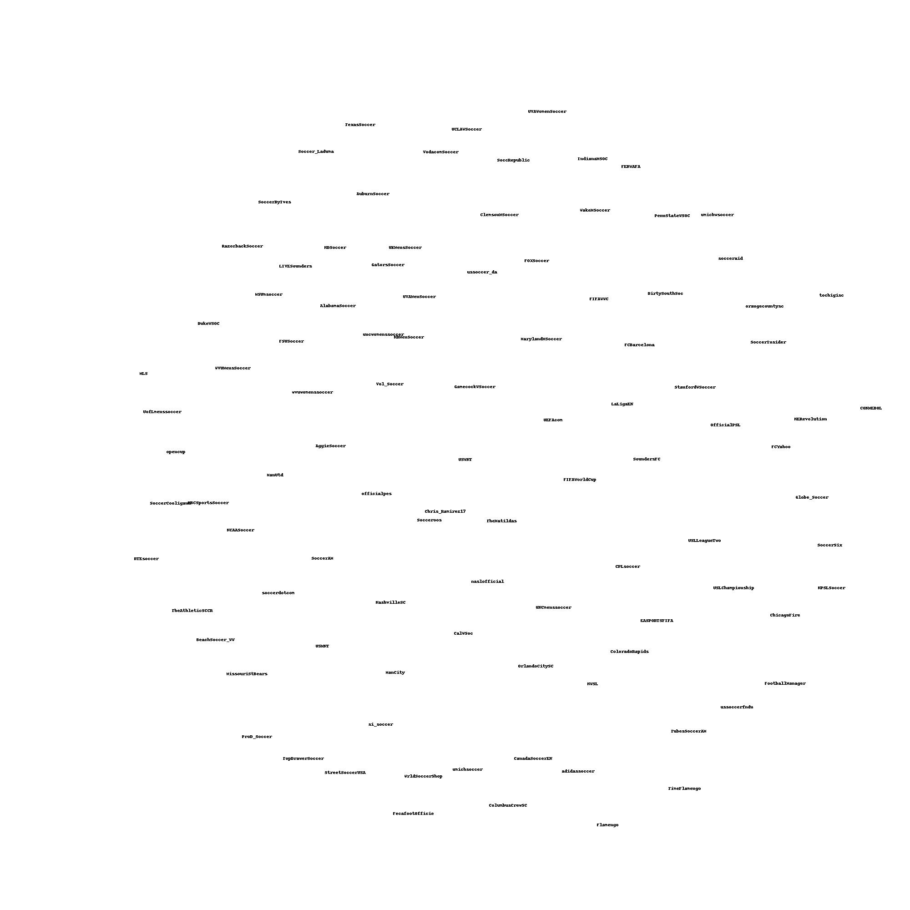

# Clustering

### Collect data

To collect 100 popular verified accounts that have > 10,000 followers and > than 5,000 tweets, I used tweepy's cursor
function to gather accounts that are associated with the search **soccer**. Because it is the most popular sport in the world (even 
though everyone outside of the United States calls if football) I figured I could easily gather a substantial number of accounts.

```
users = tw.Cursor(api.search_users, q='filter:verified soccer',lang='en').items(250)

user_frame = pd.DataFrame(columns=['screen_name','followers_count','statuses_count'])

for user in users:
    if user.followers_count > 10000 and user.statuses_count > 5000:
        confirmed_user = { 'screen_name': user.screen_name,'followers_count':user.followers_count,
                           'statuses_count': user.statuses_count}
        user_frame = user_frame.append(confirmed_user, ignore_index=True)

user_frame = user_frame.drop_duplicates()

```

[Users](q1_data/100_users.csv) contains the accounts along with their respective follower count and tweet counts for verification.


Next, I downloaded 200 English-language tweets from the 100 accounts. 

```
for index, row in users.iterrows():
    statuses = tw.Cursor(api.user_timeline, screen_name=row['screen_name'], lang='en', include_rts=False).items(200)
    filename = "q1_data/tweets_by_user/user" + str(index) + ".txt"
    with open(filename, 'a') as file:
        file.write(row['screen_name'] + ' \n')
        for status in statuses:
            file.write(status.text)
```
These tweets in their original form can be viewed line by line in this [folder](q1_data/tweets_by_user/).


### Create Account-Term Matrix
After collecting these tweets, it was necessary to remove any data that does not pertain to clustering based 
on words used. This also includes stopwords used because they do not help us find associations. These stopwords
were removed by tokenizing all the words used by each user and removing them using the Python NLTK library.


The other text removed using regex included:
* Any terms that have non-ASCII characters (ex: you\u2019ll)
* URIs
* Account names (ex: @weiglemc)
* Punctuation
* Any terms that are < 3 characters or > 15 characters long
* Converted all terms to lowercase

The code used for this cleanup is shown below or can be found [here](Q2_clean_tweets.py).

```
all_tweets_cleaned = []
all_words = ''
for i in range(100):
    user_num = i
    file_name = "q1_data/tweets_by_user/user"+str(user_num)+".txt"

    with open(file_name, 'r') as file:
        user_tweets = file.read()

    user_tweets = user_tweets.split(' ', 1)
    user_tweets[1] = re.sub('@.*', ' ', user_tweets[1]) # accounts
    user_tweets[1] = re.sub('https://.*', ' ', user_tweets[1]) # uris
    user_tweets[1] = re.sub('[.,\/}{"\')(:;!?+#=\-_]+', ' ', user_tweets[1]) # special characters and punctuation
    user_tweets[1] = re.sub(r'[^a-zA-Z ]+', ' ', user_tweets[1]) # all non-english letter characters
    user_tweets[1] = re.sub(r'\b\w{1,3}\b', ' ', user_tweets[1]) # words 3 characters and shorter
    user_tweets[1] = re.sub(r'\b\w{15,}\b', ' ', user_tweets[1]) # words 15 characters and longer
    user_tweets[1] = re.sub('\s+', ' ', user_tweets[1])

    tokens = word_tokenize(user_tweets[1])

    filtered = [w for w in tokens if not w in stop_words] # filter out stopwords
    user_tweets[1] = " ".join(filtered)
    all_tweets_cleaned.append(user_tweets)
    all_words+= user_tweets[1]

    words = [] # no duplicates/ clean
for word in all_words:
    if word.lower() not in words:
        words.append(word.lower())    # get lower case versions of words and remove duplicates
```
*The 'stopwords' used are NLTKs listed English stopwords: https://gist.github.com/sebleier/554280*


The initial set of words contained 7199 words. This has been reduced in size to the 1000 most used words across these tweets
ordered from highest overall use of word to lowest. Screen names are in the initial collection order.

**Code used for getting the final 1000**
```
all_terms = pd.read_csv("q2_data/unordered_matrix.csv")
all_terms = all_terms.set_index('screen_name')


s = all_terms.sum()

all_terms = all_terms[s[s>1].nlargest(1000).index]

all_terms.to_csv('1000_terms.csv')
```

**The below table represents the final [1000 words](1000_terms.csv)**

| screen_name |  goal  |  first  |  back |  match  |  ...  |  ruled  |  seal  |  semi  |  semifinal |
|:------- |   :----:   |  :----:   |  :----:   |  :----:   |  :----:   |  :----:   |  :----:   |  :----:   | :----:   |                                                   
|USMNT           |  0   |  1   | 1   |  1  | ... |   0 |  0  | 0  |      0  |
|MLS             |  0  |  0  | 0  |  0  | ... |   0 |  0  | 0  |      0  |
|USWNT           |  2  |  5 | 5  |  1 | ... |   0 |  0  | 0  |      0  |
|CanadaSoccerEN  |  0  |  0 | 0  |  1  | ... |   0 |  0  | 0  |      0  |
|SoundersFC      |  5  |  1  | 1  |  1  | ... |   0 |  0  | 0  |      0  |
|...             |  ...  |  ...  | ...  |  ...  | ... |   ... |  ...  | ...  |      ...  |
|CONMEBOL        |  0  |  0  | 0  |  0  | ... |   0 |  0  | 0  |      0  |
|Socceroos       |  2  |  4  | 0  |  1  | ... |   0 |   0 |   0 |        0|
|FootballManager |  0  |  0  | 0  |  0  | ... |   0 |  0  |   0 |        0|
|FecafootOfficie |  0  |  1  | 0  | 14  | ... |   0 |  0  |   0 |        0|
|tochigisc       |  0  |  0  | 0  |  0  | ... |   0 |  0  |   0 |        0|

100 rows x 1000 columns


### Dendrograms
To view similarities across the users based on words used in tweets, I created a dendrogram containing all the users.
To generate this dendrogram, I used the [clusters](clusters.py) module obtained from: https://github.com/arthur-e/Programming-Collective-Intelligence/blob/master/chapter3/clusters.py.

A few changes were made in reading the files to use comma separated values rather than tab separated int the `readfile()` function.
 
 
 
 Also in the `scaledown()` function some error handling for float division by zero was added:
 


Then these functions were used in the [code](Q3_dendros.py):

```
import clusters

file = ''
with open('1000_terms.csv') as f:
    file = f.readlines()

screen_names, words, data = clusters.readfile(file)


print(clusters.readfile(file))
clust = clusters.hcluster(data)
#
#clusters.printclust(clust, labels=screen_names)
clusters.drawdendrogram(clust,screen_names,jpeg='q3_data/userclust.jpg')
```

The ouput generated by the `drawdendrogram()` function of [clusters.py](clusters.py):



### k-means 
Once again for this task, the [clusters](clusters.py) module was used to generate k-clusters
for each of the k values: 5, 10 ,20.
```
import clusters

def get_clusts(data):
    kclust5 = clusters.kcluster(data, k=5)
    kclust10 = clusters.kcluster(data, k=10)
    kclust20 = clusters.kcluster(data, k=20)
    return kclust5, kclust10, kclust20
```

The individual clusters can be found in these files:

* [k = 5](q4_data/k5) ------> 4 iterations
* [k = 10](q4_data/k10) ----> 4 iterations
* [k = 20](q4_data/k20) ----> 5 iterations


These sets of clusters can be observed in the below tables:

##### k = 5


##### k = 10


##### k = 20


From looking at these charts it is very apparent that the most reasonable clusters were created by a
*k* value of 10. k=5 created a large cluster and other small ones while k=20 seems to separate the values
too much for a dataset of 100 users. If we were using 1000 users or even 10,000, k=20 might be a better choice.


### MDS

For this question, I created a MDS using the `scaledown()` and 'draw2d()' functions of the [clusters](clusters.py) module.

The code for this generation can be viewed below:

```
with open('1000_terms.csv') as f:
    file = f.readlines()

users, words, data = clusters.readfile(file)

coords = clusters.scaledown(data)
clusters.draw2d(coords,users,jpeg='q5_data/twitter_user_MDS.jpg')
```

This dataset required 587 iterations to generate the MDS below:





