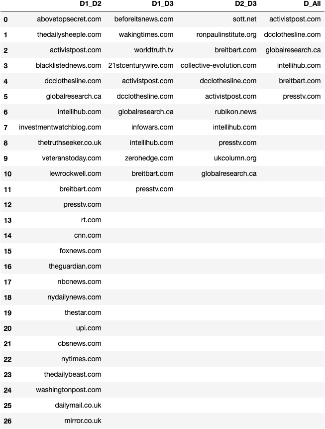
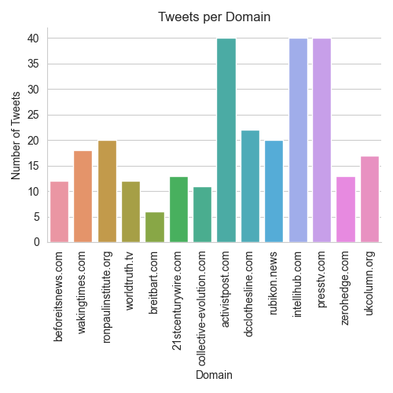
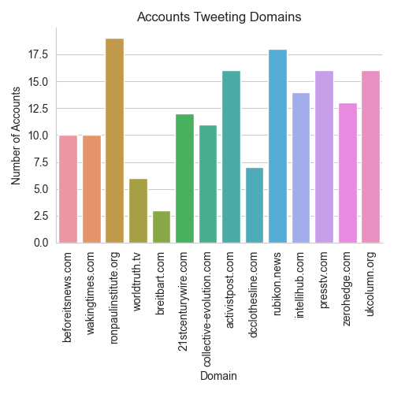
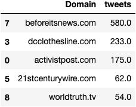
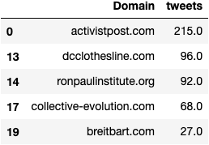
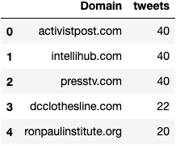
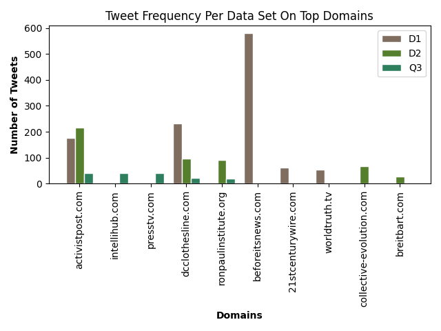

# Analyzing Disinformation Domains

### P1

From the 1679 URIs found in [D2](project_files/D2.csv):
 * 792 of the links redirected to another URI
 * 1166 of the links reported a 200 OK HTTP response
 * 206 of the link reported a 404 Not Found HTTP response
 * and 307 reported other non-200 responses.

While collecting this information a file was created to show each of the unique domains, 
the number of times that domain appeared in the [D2](project_files/D2.csv) data set, 
and the total number of tweets the domain appeared in. Click [here](/project_files/D2_domains_and_tfreq.csv)
to view the generated file.

By further processing of the above file, it was found that [D2](project_files/D2.csv) contains 339 unique domains.

**Top 5 Domains**

|   | URL   | tweets  |
|---|---|---|
|  1 | mintpressnews.com  |  1558.0 | 
|  2 |  rt.com | 1502.0  | 
|  3 | newsweek.com  |  1252.0 |  
|  4 | alternet.org  |  1221.0 | 
|  5 |  cnn.com |  756.0 | 

It is interesting to see the domains in this top 5 include a few sources that are notorious for presenting disinformation.

### P2

The table below represents an overlap in domains found in [D1](project_files/D1.csv), [D2](project_files/D2.csv), and [D3](project_files/D3.csv).

I found the column representing domains that are present in all of the datasets to be interesting. There is significant false information 
related to mass shootings and Syria floating around on the internet so comparing sites that were known for posting false information related to 
COVID-19 takes away credibility from the sites that appear in all 3 of these datasets.

### P3

[200_tweets.csv](project_files/200_tweets.csv)
Using the domains that appeared in [D3](project_files/D3.csv) (False COVID-19 information), 284 tweets were collected that contain
these domains in links. Because the collection number was rather small, tweets were only gathered from the past 2 days, 5:09:19. 
Of these tweets, it was found they were posted by 170 different accounts. 

The below graph shows the number of tweets out of the 284 that were collected that contained a link for each of the common domains.

The below graph shows the number of accounts out of the 170 in the initially collected tweets that tweeted links with each of the same
domains.

 
 
After looking further into the domains in these graphs, I had some very interesting findings, especially with activistpost.com. Upon visiting
this site, it was very apparent that it is full of extremist right wing propaganda, similar to that which is proposed by President Trump. 
After already making the deduction that this was one of the sites that could not be trusted because it appeared in all three datasets, 
I read the headline: "Dr. Fauci Warns US Likely To Cancel Christmas, Hints That Masks & Social Distancing Are Here To Stay".

From what I have experienced in the past, many of these 3rd party sites that claim to be politically moderate use appeal to emotion to 
promote false information. 

### P4

For this section, the number of tweets per domain ([data from Q3](project_files/tweets_per_domain.csv)) was compared with the original D1 data and your domain dataset from Q1 ([D2](project_files/D2.csv)).  

The top domains found in dataset [D1](project_files/D1.csv) and the [data from Q3](project_files/tweets_per_domain.csv):

 

The top domains found in dataset [D2](project_files/D2.csv) and the [data from Q3](project_files/tweets_per_domain.csv):

The top domains found in the [data from Q3](project_files/tweets_per_domain.csv):

  

While the common information displayed in the above tables is fairly apparent, the graph below further breaks down their frequencies and 
consistency across the datasets. 
  
 

As we can see, beforeitsnews.com has a substantial frequency in D1 but was not in the top 5 of the other datasets. Which means it may contain 
disinformation but it is hard to discern solely from these comparisons. 

On the other hand, activistpost.com appeared in the top 5 in higher frequency than any others in all 3 datasets. As noted in **Q3** this site is 
clearly not reputable so finding this to be the most common across the initial datasets was not a surprise.

