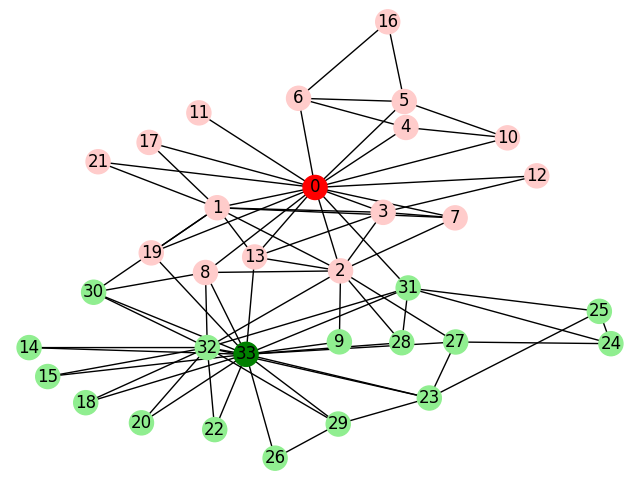

# Graph Partitioning

#### 1. Karate Club Graph
To draw the graph of the Zachary's Karate Club data set, I imported this data set from Networkx. The following graph
represents the two karate masters, Mr. Hi (dark red) and John A (dark green), and their respective students in light red
and light green. This data set imported from Networkx also included the teacher group for which each student node belongs.



The script used to gather this data and graph it can be found below or in [Graph_1.py](Graph_1.py).

```
import matplotlib.pyplot as plt
import networkx as nx

G = nx.karate_club_graph()

color = ["#1f78b4"] * 34
color[0] = "red"
color[33] = "green"

for i in range(len(G.nodes)):
    if i != 0 and i != 33:
        if G.nodes[i]["club"] == 'Mr. Hi':
            color[i] = "#ffcccb"
        else:
            color[i] = "#90ee90"

nx.draw_kamada_kawai(G, with_labels=True, node_color=color)
plt.savefig('Graphs/before_split.png')
plt.show()
```
As you can see, using `G.nodes[i]["club"]` will return the karate club to which the individual represented by node 'i' belongs. 

#### Girvan-Newman Graph Partitioning    

The **Girvan-Newman** graph partitioning algorithm is used for splitting a graph into sub-graphs by removing the edges with the 
highest betweenness. By looping through and removing the edge with the highest betweenness one by one, we can observe the graph splitting into groups
that are closer to one another.

This algorithm has three main steps:
* Calculate betweenness of all edges
* Remove the edge(s) with the highest betweeness
* Repeat steps 1 and 2 until graph is partitioned.

Thankfully, Networkx provides built in functions to determine the betweenness of all edges in a graph. Using `nx.edge_betweenness_centrality()` where *nx* is
the import name of Networkx, A python dictionary is generated containing the betweenness of all edges in the format `(node1,node2):betweenness_value`.

By using this function, I was able to calculate the max betweeness with little to no trouble for the Girvan-Newman algorithm.

```
def find_max_betweenness(G):
    max = 0
    max_e = None

    f = nx.edge_betweenness_centrality(G, k=None, normalized=True, weight=None, seed=None)
    for edge in f:
            if max < f[edge]:
                max = f[edge]
                max_e = edge

    max_edge = list(max_e)
    return max_edge

def girmin_newman(iteration_num, G):
    for i in range(iteration_num):
        max_between = find_max_betweenness(G)
        G.remove_edge(max_between[0], max_between[1])

```
In this program I split the finding of max betweenness out of `girvan-newman()` for easier code interpretation. 
The `girvan-newman()` function takes the number of iterations to run as a parameter so each iteration can be observed in
it's own respective graph. To make this a little easier on myself, I used command line input to increase or decrease the number 
of iterations by one.

```
    # input value via command line
    value = ''
    # Number of iterations to perform in girvan_newman()
    iterate = 0
    # Loop to prompt for input of change in number of iterations
    while value != 'e':
        # Gather dataset from NetworkX
        G = nx.karate_club_graph()

        # Remove edges with highest betweenness
        girmin_newman(iterate, G)
        
        # Graph formatting
        color = color_nodes()
        iterations = str(iterate) + " iterations"
        ax = plt.gca()
        ax.set_title(iterations)
        nx.draw_kamada_kawai(G, with_labels=True, node_color=color, ax=ax)
        plt.savefig('Graphs/after_' + iterations)
        plt.show()
        
        # Command line input
        value = input("Enter + to increase iterations or - to decease: ")
        if value == '+':
            iterate += 1
        if value == '-':
            iterate -= 1
``` 
The above code for question **2** can be found at [Graph_2.py](Graph_2.py).

##### The Initial Graph
To observe the changes through the Girvan-Newman algorithm, we first start with the graph generated in question **1**.


##### First Iteration


##### Second Iteration


##### Third Iteration


##### Fourth Iteration


##### Fifth Iteration


At this point, We can see that the graph has began to separate into two collectives based around node 0 and 33, i.e. the two karate teachers.

##### Sixth Iteration


##### Seventh Iteration


Almost There!

##### Eighth Iteration


##### Ninth Iteration


##### Tenth Iteration


The tenth iteration is the last where the two graph partitions will be connected. As you can see, the edge between nodes 2 and 13 will
be the last to go.


##### Eleventh Iteration
After this iteration, the two graphs become two individual partitions. I had trouble with displaying this part because their centers are 
forced to the gravity of the graph so they display on top of each other. Unfortunately I was unable to figure out how to show them separately. However, they are split into two partitions and from the previous iteration, 
one can see which points belong to which graph.


#### Comparison: Before and After Split

Before the split, I colored the nodes by using the predefined data from NetworkX pertaining to which group each node belongs. However,
after running enough iterations of the Girvan-Newman algorithm to split the data, I found that nodes 2 and 8 ended up being in the <span style="color: green;">John A</span> 
group rather than the <span style="color: red;"> Mr. Hi </span> group. Other than that, all the other notes were consistent with the predicted
data. 

Another notable feature of the final graph is that the positions and length of edges reflecting betweenness have changed from the original.
With the removal of higher betweenness levels, some of the edges with lower betweenness began to represent a higher ratio of betweenness in relation
to others in in their respective partitions.
