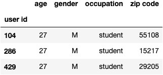
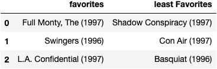
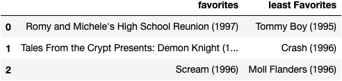
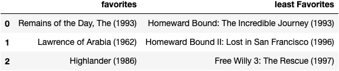
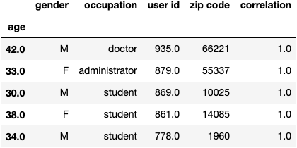
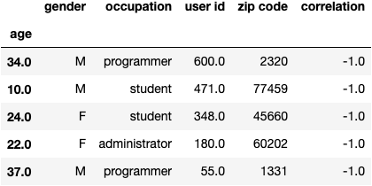
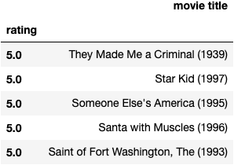
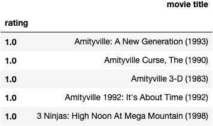
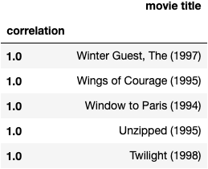
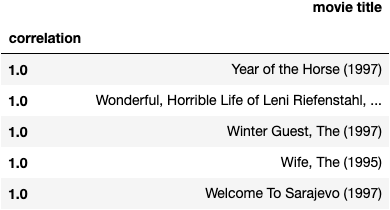

# Homework 7 - Recommendation Systems
#### Andrew Paterson - CS 432

### Dataset

The datasets used in this assignmement were gathered from https://grouplens.org/datasets/movielens/100k/.
The datasets were collected by the [GroupLens Research Project](https://grouplens.org/) at the University of 
Minnesota during the seven-month period from September 19, 1997 through April 22, 1998.  We are using the "100k dataset", available from
https://grouplens.org/datasets/movielens/100k/ 

There are three files used:

1.  [u.data](ml-100k/u.data): 100,000 ratings by 943 users on 1682 movies. Each user has rated at least 20 movies. Users and items are numbered
consecutively from 1. The data is randomly ordered. This is a tab separated list of 

```
user id   item id   rating    timestamp
```

The timestamps are Unix seconds since 1/1/1970 UTC.

Example:
```
196     242     3       881250949
186     302     3       891717742
22      377     1       878887116
244     51      2       880606923
166     346     1       886397596
298     474     4       884182806
115     265     2       881171488
```

2.  [u.item](ml-100k/u.item): Information about the 1682 movies. This is a tab separated list of

```
movie id | movie title | release date | video release date | IMDb URL | unknown | Action | Adventure | Animation |Children's | Comedy | Crime | Documentary | Drama | Fantasy | Film-Noir | Horror | Musical | Mystery | Romance | Sci-Fi | Thriller | War | Western |
```

The last 19 fields are the genres, a 1 indicates the movie is of that genre, a 0 indicates it is not; movies can be in several genres at once. The movie ids are the ones used in the u.data dataset. 

Example:

```
161|Top Gun (1986)|01-Jan-1986||http://us.imdb.com/M/title-exact?Top%20Gun%20(1986)|0|1|0|0|0|0|0|0|0|0|0|0|0|0|1|0|0|0|0 
162|On Golden Pond (1981)|01-Jan-1981||http://us.imdb.com/M/title-exact?On%20Golden%20Pond%20(1981)|0|0|0|0|0|0|0|0|1|0|0|0|0|0|0|0|0|0|0 
163|Return of the Pink Panther, The (1974)|01-Jan-1974||http://us.imdb.com/M/title-exact?Return%20of%20the%20Pink%20Panther,%20The%20(1974)|0|0|0|0|0|1|0|0|0|0|0|0|0|0| 0|0|0|0|0
``` 

3.  [u.user](ml-100k/u.user): Demographic information about the users. This is a tab separated list of:

```
user id | age | gender | occupation | zip code
```

The user ids are the ones used in the u.data dataset.

Example:
```
1|24|M|technician|85711 
2|53|F|other|94043 
3|23|M|writer|32067 
4|24|M|technician|43537 
5|33|F|other|15213
```

### External Code
The python module `recommendations.py` from Ch 2 of *Programming Collective Intelligence* was used to performs 
 movie recommendations from the MovieLens dataset.  

https://github.com/arthur-e/Programming-Collective-Intelligence/blob/master/chapter2/recommendations.py

This code has been slightly modified to function with this project and is also available [here](recommendations.py).

## Questions

### Q1

To find 3 users who are closest to me in terms of age, gender, and occupation, I read the `u.user` file into 
a pandas dataframe. Because this information was needed in other areas, I created the [Data.py](Data.py) module for easy reference.
After collecting this information in the dataframe, I then looped through each entry to find the closest matches to me. I am 27 year old male student.

##### Closest three users to my demographic



After collecting these users, I then gathered all the movies they rated and picked the top 3 and bottom 3. Unfortunately, the scale is only out of
5 in these ratings so it is hard to tell if these were actually their top three. However, for the purposes of this program their top and bottom rated 
movies give us a little idea about their film taste.

Rather than generating 6 Tables, I paired users' favorites and least favorites. 

##### User id: 104


##### User id: 286


##### User id: 429



Although I initially leaned towards assimilating myself with **user 104** because I enjoy the movie *Swingers*, I have more similar taste
in movies to **user 429**. 

For the following questions, **user 429** was used as the substitute me.


### Q2
To find the 5 users that are most and least correlated to **user 429**, I used the pre-created [recommendations.py](recommendations.py)
`topMatches()` function and copy of it that shows the least reccomended `leastMatches()`. From these matches created,
I used the pre-created [Data.py](Data.py) `get_users()` function to give me a pandas dataframe of all the users in [u.user](ml-100k/u.user). 
I then used this dataframe to find the full user data based on the user id/index of the matches.


```
import pandas as pd
import Data
import recommendations

users = Data.get_users()
prefs = recommendations.loadMovieLens()

person_list = list(prefs)

sub_me = person_list[429]

top5 = recommendations.topMatches(prefs,sub_me)
bottom5 = recommendations.leastMatches(prefs,sub_me)
print(top5)
print(bottom5)
top5_frame = pd.DataFrame()
bottom5_frame = pd.DataFrame()

for i in range(len(top5)):
    top5_frame = top5_frame.append(users.iloc[int(top5[i][1])-1])
    bottom5_frame = bottom5_frame.append(users.iloc[int(bottom5[i][1])-1])

top_correlations = []
bottom_correlations = []

for i in range(len(top5)):
    top_correlations.append(str(top5[i][0]))
    bottom_correlations.append(str(bottom5[i][0]))

top5_frame['correlation'] = top_correlations
bottom5_frame['correlation'] = bottom_correlations
```
#### Output

##### 5 users most correlated to me


##### 5 users least correlated to me


### Q3
To compute ratings for all the films that **user 429** has not seen, once again I used functions from [recommendations.py](recommendations.py).
The `getReccomendations()` function takes the initial user/movie grouping `prefs` and single user to generate a list of movie tuples
(overall rating, film)  that the user has not seen. This list is ordered from highest overall rating to lowest overall rating.

[q3_not_seen_ratings.csv](csv_files/q3_not_seen_ratings.csv)
```
prefs = recommendations.loadMovieLens()
person_list = list(prefs)
sub_me = person_list[429]

recommendations_list = recommendations.getRecommendations(prefs,sub_me)

top_5_rec = recommendations_list[0:5]
bottom_5_rec = recommendations_list[-5:]

with open('csv_files/q3_not_seen_ratings.csv', 'w') as output:
    csv_out = csv.writer(output)
    csv_out.writerow(['rating','movie title'])
    csv_out.writerows(recommendations_list)
```
#### Output
##### Top 5 recommendations for films that the **user 429** should see.  



##### Bottom 5 recommendations (i.e., films the **user 429** is almost certain to hate).



### Q4
 
Choosing my favorite and least favorite from this list was difficult because there are a lot of movies in the 
[u.item](ml-100k/u.item) dataset that I really like such as The Godfather, Silence of the Lambs, and Trainspotting.
I ended up choosing *Reservoir Dogs (1992)* as my top movie because I enjoy that movie and was seeking to get the least
cliche results. I also had a difficult time choosing my least favorite movie because I did not see any titles that I 
remembered being particularly bad. Instead I chose a movie that I would currently have no interest in watching: 
*Winnie the Pooh and the Blustery Day (1968)*. I'm sure I would have very much enjoyed this movie as a child but I
have no interest now.

To collect a list of recommended movies for me, I started with using the functions `loadMovieLens()` and 
`calculateSimilarItems()` from [reccomendations.py](recommendations.py). The result of `calculateSimilarItems()`
returns a python dictionary that holds the top ten most similar movies to each movie in the dataset [u.item](ml-100k/u.item).

Because this chart is very large, it is more ideal to index the results based on film. Below is a segment from
the script used to collect this data. The first 5 results from `good_movie` and `not_for_me` can be found in the files:
[q4_top_rec.csv](csv_files/q4_top_rec.csv) and [q4_bad_rec.csv](csv_files/q4_bad_rec.csv).

```
prefs = recommendations.loadMovieLens()

similarities = recommendations.calculateSimilarItems(prefs)

good_movie = similarities['Reservoir Dogs (1992)']
not_for_me = similarities['Winnie the Pooh and the Blustery Day (1968)']
```
#### Output

##### Top recommended for me


##### Recommended not to watch


I think that this is a pretty good representation of films I would like. I have only seen *Twilight (1998)*, which I enjoyed but
after reading the descriptions of the others I'm sure I would like them as well. I have a very broad range of movie genres that
hold my interest though. I think that to get a more accurate recommendation for myself, it would be very beneficial to provide my own ratings on 
at least 20 of the films in the dataset and make the same comparisons that were made for **user 429**.
