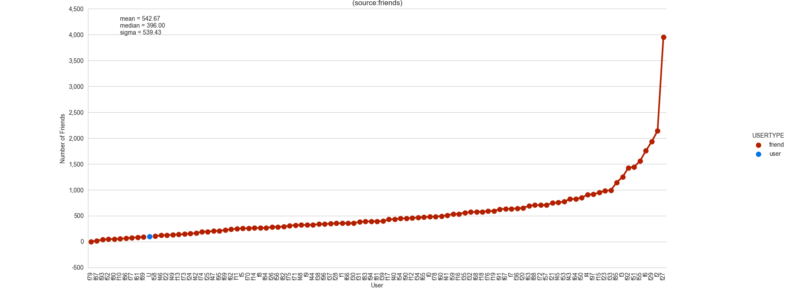
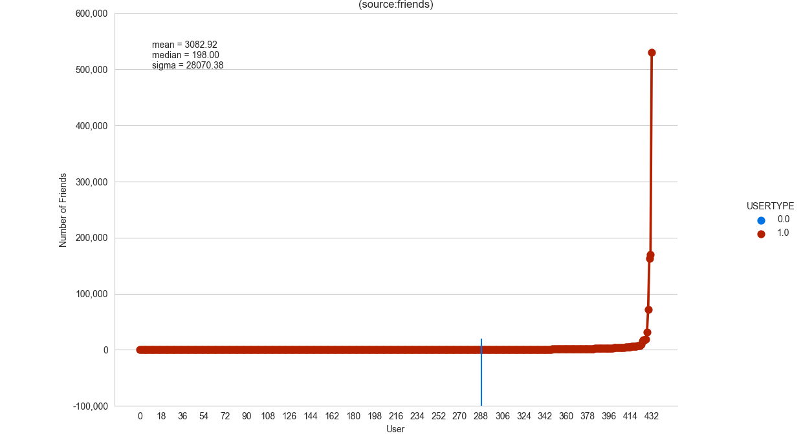

# Homework 4 - Exploring Social Networks
### Andrew Paterson

### Q1. Friendship Paradox on Facebook

After creating a graph, it is very apparent that the friendship paradox holds true for this user.
The majority of this user's friends have more friends than they do. This can be seen in the below graph
where the user is represented with a blue dot.
 
##### mean: 542.67
##### median: 396.00
##### standard deviation: 539.43

Graph data: [facebook.png](ouput/facebook.png)

I found it very interesting how large the standard deviation is for this graph. This is almost certainly caused
by the very large number of friends held by users on the right side of the graph.

The program that created this graph can be found at [facebook_friends.py](facebook_friends.py).

### Q2. Friendship Paradox on Twitter

Because I have less than 50 followers on twitter, I used [weiglemc](https://twitter.com/weiglemc/)
for this portion of the assignment. In this instance the user has more followers than most of her 
followers however, if the total number of followers held by users on either side of the user are pooled together and compared, 
the friendship paradox still holds true. In the graph below, the user's follower count dot was not visible due
to the high volume of data so a blue line represents the placement of weiglemc in comparison with her 
followers. Also the values in the legend represent a boolean value for if the account is a follower.
##### standard deviation: 28070.53933210418
##### mean: 3082.9006928406466
##### median: 198.0

